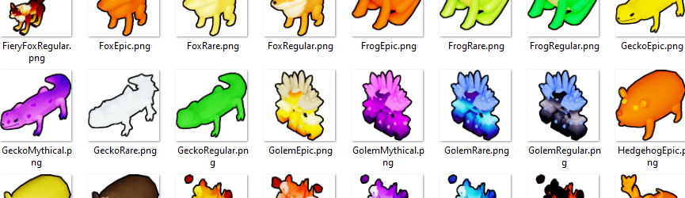

## Synopsis

Roblox games often have collectibles - inventories, pets, etc. We need to display them in a menu. ViewportFrames aren't a scalable solution, but authoring pre-rendered icons is time-consuming and finicky. This project automates the whole process.

Icon creation is in 4 distinct stages - rendering, downscaling, uploading, and collection into a JSON file. The [Ninja build system](https://ninja-build.org/) creates a dependency graph, only executing a step if a source file has been changed or added.

This project is not a definitive solution - it's a template, hackable to meet your game's needs.
* You _will_ want to adjust the scene setup in your `template.blend`. Tune the lighting and shading effects to match your game's artstyle.
* You _will likely_ want to modify `blenderScript.py`, to get different camera angles and zooms.
* You _will likely_ want to change the downscaled image size (128x128 by default).

## Prerequisites

- Fill your Roblox details into `.env`. A template is provided at `.env.example`.
- With Python (version >=10), install dependencies; `pip install urllib3 python-dotenv requests Pillow`.
- A [recent version of Blender](https://www.blender.org/download/). Offline installed versions and [Steam](https://store.steampowered.com/app/365670/Blender/) are supported.
- [Ninja](https://ninja-build.org/). No installer is provided for Windows - if it's easier for you, simply drop the executable into this folder.

## Usage

1. Export models from studio into a folder named `content` inside of this repo. Use a [batch export plugin like this](https://www.roblox.com/library/11800941672). The filenames of your `.obj`s will correspond to the AssetIds within the exported icon data, so ensure they're descriptive.
2. Run `py 0_ninja.py` to re-generate build commands.
3. Run `ninja` to attempt a build.
4. Copy the exported `out/out.json` into your game's source tree.

Re-generate build commands if you've added or removed models. Re-run the build after regenerating build commands, or to retry a failed build.

## License

This source is available under GPL. Though work (icons) created from this toolkit aren't subject to the infectious license, the source is. Any and all modifications must be made public.
If you're planning on adapting or working with this tool long-term, please contact me to license this code free of GPL restrictions.

## Attribution
The default `template.blend` file includes [brown_photostudio_02](https://polyhaven.com/a/brown_photostudio_02) from [PolyHaven](https://polyhaven.com/), licensed under CC0.